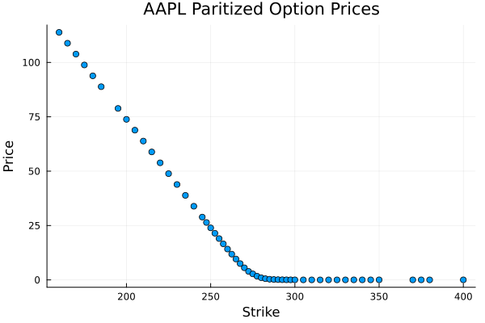
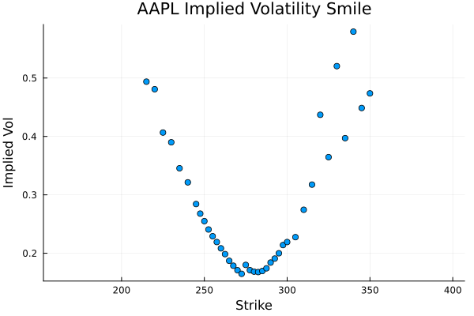
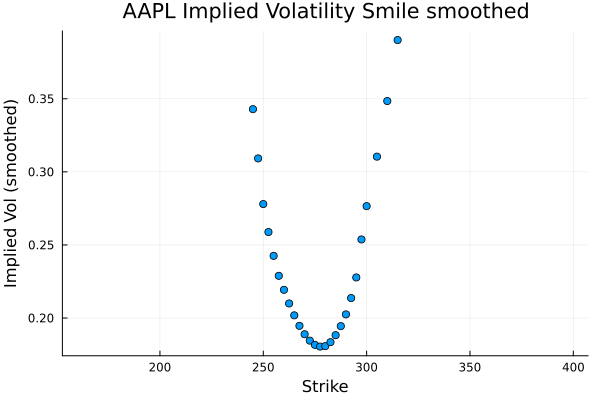
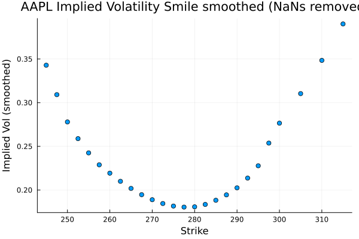
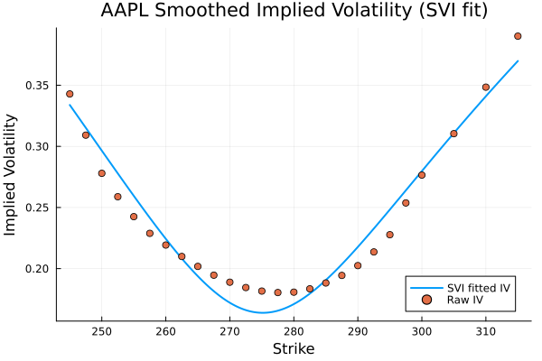
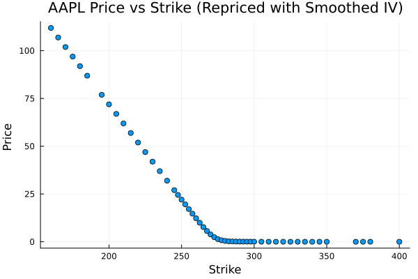
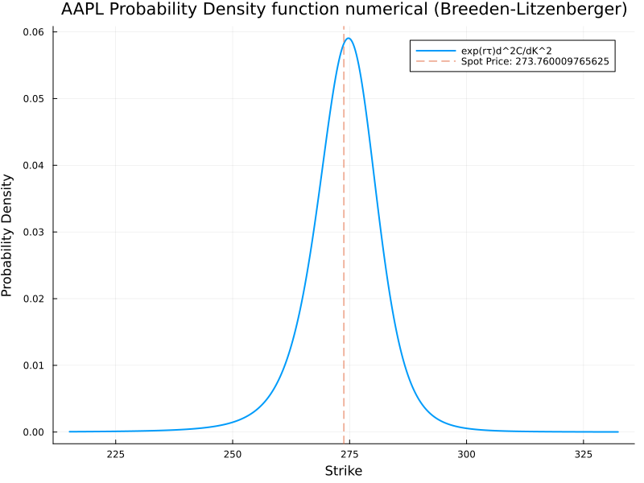

# Oipd.jl Technical Documentation

## Overview

Oipd.jl is a Julia package implementing advanced options pricing models and risk-neutral probability analysis. The package combines real-time market data with sophisticated mathematical models to provide accurate pricing and risk assessment tools.

## Process Overview

The process of generating the PDFs and CDFs is as follows:

1. **Data Acquisition**: For an underlying asset, options data along the full range of strike prices are read from a source file to create a DataFrame. This gives us a table of strike prices along with the last or mid price each option sold for.

2. **Put-Call Parity Preprocessing**: Apply put-call parity to create synthetic call prices from out-of-the-money put prices, reducing noise from illiquid in-the-money quotes.

3. **OTM Filtering**: Restrict to out-of-the-money options only, keeping calls with strike prices above the current spot price and using synthetic calls constructed from OTM puts via parity.

   

4. **Implied Volatility Calculation**: Using the Black-Scholes-Merton pricing model, convert option prices into implied volatilities (IV). IVs are solved using Newton's method with analytical derivatives.

   

5. **Gaussian Smoothing**: Apply Gaussian kernel smoothing to the implied volatilities to reduce noise and outliers before surface fitting.

   
   

6. **Volatility Surface Fitting**: Fit the smoothed implied-volatility smile using the SVI (Stochastic Volatility Inspired) model. During optimization, constrain the raw parameters ($b \geq 0$, $|\rho| \leq \rho_{\text{bound}} < 1$, $\sigma \geq \sigma_{\text{min}}$) and enforce the Gatheral-Jacquier minimum-variance condition $a + b\sigma\sqrt{1-\rho^2} \geq 0$. After calibration, evaluate the butterfly diagnostic $g(k)$ on an extended log-moneyness grid; if $\min g < 0$ a CalculationError is raised.

   

7. **Price Curve Generation**: From the fitted volatility smile, use the Black-Scholes-Merton model to generate a continuous curve of option prices along the full range of strike prices.

   

8. **PDF Extraction**: From the continuous price curve, use numerical differentiation to compute the second derivative of call prices with respect to strike. The second derivative multiplied by the discount factor $e^{r\tau}$ gives the risk-neutral probability density function (Breeden-Litzenberger formula).

   

9. **CDF Calculation**: Once we have the PDF, calculate the cumulative distribution function through numerical integration.

## Mathematical Framework

### Black-Scholes Model

The package implements the classic Black-Scholes model for European options:

$$
\begin{aligned}
C(S, K, T, r, \sigma, q) &= S e^{-qT} N(d_1) - K e^{-rT} N(d_2) \\
P(S, K, T, r, \sigma, q) &= K e^{-rT} N(-d_2) - S e^{-qT} N(-d_1)
\end{aligned}
$$

Where:
- $d_1 = \frac{\ln(S/K) + (r - q + \sigma^2/2)T}{\sigma\sqrt{T}}$
- $d_2 = d_1 - \sigma\sqrt{T}$
- $N(\cdot)$ is the cumulative normal distribution

Implied volatility is calculated using Newton-Raphson iteration with analytical derivatives.

### SVI (Stochastic Volatility Inspired) Model

The SVI model parameterizes the volatility surface using:

$$w(k) = a + b \left( \rho (k - m) + \sqrt{(k - m)^2 + \sigma^2} \right)$$

Where:
- $k = \ln(K/F)$ is the log-moneyness
- $F = S e^{rT}$ is the forward price
- $a, b, \rho, m, \sigma$ are the SVI parameters

#### Parameter Constraints
- $b > 0$: Ensures positive slope
- $|\rho| \leq 1$: Correlation bounds
- $\sigma > 0$: Minimum volatility
- $a + b\sigma\sqrt{1-\rho^2} \geq 0$: No-arbitrage condition (Gatheral-Jacquier)

#### Reparameterization
For optimization stability, parameters are reparameterized:
- $a = a_{\text{raw}}$
- $b = \exp(b_{\text{raw}})$
- $\rho = \rho_{\text{bound}} \cdot \tanh(\rho_{\text{raw}})$
- $\sigma = \sigma_{\text{min}} + \exp(\sigma_{\text{raw}})$

### Why Not Spline Fitting?

A common alternative to parametric models like SVI is to fit the volatility smile using splines or other interpolation methods. While seemingly simpler, spline fitting introduces several critical problems that make it unsuitable for risk-neutral density extraction:

#### Arbitrage Violations
Spline interpolation can create arbitrage opportunities by violating fundamental no-arbitrage conditions. The resulting volatility surface may have negative densities or inconsistent pricing.

#### Extrapolation Issues
Splines perform poorly outside the range of observed data points. Since risk-neutral density estimation requires evaluating the volatility surface over a continuous domain, poor extrapolation can lead to nonsensical results.

#### Numerical Instability
The second derivatives required for Breeden-Litzenberger density extraction are highly sensitive to the smoothness and continuity of the volatility surface. Splines can introduce unwanted oscillations or discontinuities.

#### Example: Spline vs SVI Fitting

The following plots demonstrate the problems with spline fitting compared to the SVI model:


*Spline interpolation of the volatility smile often creates unrealistic shapes and extrapolation behavior.*


*The SVI model provides smooth, arbitrage-free volatility surfaces with proper asymptotic behavior.*


*Prices derived from spline-fitted volatilities can exhibit non-monotonic behavior and arbitrage opportunities.*


*SVI-generated prices maintain proper convexity and no-arbitrage properties.*


*The PDF from spline fitting shows negative densities and unrealistic shapes due to arbitrage violations.*


*The SVI-based PDF is smooth, positive, and integrates to 1, representing a proper probability distribution.*

The SVI model's parametric form ensures mathematical consistency and prevents arbitrage, making it the preferred choice for applications requiring reliable risk-neutral density estimation.

### Risk-Neutral Density Estimation

#### Breeden-Litzenberger Formula
The risk-neutral density is extracted from option prices using:

$$q(K) = e^{rT} \frac{\partial^2 C}{\partial K^2}$$

Where $q(K)$ is the risk-neutral density at strike $K$.

#### Numerical Implementation
The package implements numerical differentiation:
1. Fit SVI model to observed volatility smile
2. Generate dense strike grid
3. Compute second derivatives numerically
4. Integrate to obtain cumulative probabilities

## Data Pipeline

### Options Data Fetching

```julia
function get_option_prices(ticker::String, expiry::String)
    # 1. Fetch from Yahoo Finance via PythonCall
    # 2. Convert to DataFrames
    # 3. Compute mid prices: (bid + ask) / 2
    # 4. Health check quotes
    # 5. Return call_df, put_df
end
```

### Data Cleaning

- **Quote Health**: Checks for live bid/ask spreads
- **Paritization**: Combines OTM calls and synthetic OTM calls from puts
- **Gaussian Smoothing**: Reduces noise in implied volatility
- **NaN Removal**: Handles missing data points

## Algorithm Details

### SVI Calibration

1. **Data Preparation**:
   - Convert strikes to log-moneyness: $k = \ln(K/F)$
   - Convert volatilities to total variance: $w = \sigma^2 T$

2. **Optimization**:
   - Objective: $\min \sum_i w_i [w(k_i) - w_{\text{data},i}]^2$
   - Algorithm: Nelder-Mead (derivative-free)
   - Constraints: Reparameterized for positivity

3. **Arbitrage Checking**:
   - Verify $\min g(k) \geq 0$ where $g(k)$ tests for butterfly arbitrage
   - Check Gatheral-Jacquier condition

### Probability Calculation

```julia
function p_below(strike, spot, iv_fun, rate, τ)
    # 1. Generate dense strike grid
    # 2. Compute risk-neutral density via Breeden-Litzenberger
    # 3. Integrate density below strike
    # 4. Return cumulative probability
end
```

## Implementation Notes

### Performance Considerations

- **Vectorization**: All computations use vectorized operations
- **Memory Efficiency**: DataFrames for structured data, arrays for computation
- **Caching**: Intermediate results stored to avoid recomputation

### Error Handling

- **Data Validation**: Checks for sufficient options data
- **Numerical Stability**: Handles edge cases in volatility calculations
- **Convergence Monitoring**: Tracks optimization success

### Testing

Comprehensive test suite covering:
- Unit tests for all mathematical functions
- Integration tests with synthetic data
- Arbitrage detection validation
- Convergence testing

## API Reference

### Core Functions

#### Data Functions
```julia
get_option_prices(ticker, expiry) -> (call_df, put_df)
get_spot_price(ticker) -> Float64
get_closest_expiry(ticker) -> String
```

#### Pricing Functions
```julia
# Black-Scholes-Merton
BlackScholesMerton(S, K, T, t, r, σ) -> BlackScholesMerton
(bsm::BlackScholesMerton)(option_type::OptionType) -> Float64
newtons(bsm, option_type, market_price) -> Float64  # implied volatility

# SVI
fit_svi_smile(K, iv, F, T) -> (fit_result, iv_function)
w(k, a, b, ρ, m, σ) -> Float64
```

#### Probability Functions
```julia
prob_below(ticker, strike, expiry, savedir=nothing) -> Float64
prob_at_or_above(ticker, strike, expiry, savedir=nothing) -> Float64
```

#### Plotting Functions
```julia
plot_iv_smile(data, ticker, savedir)
plot_svi_fit(data, iv_fun, ticker, savedir)
plot_pdf_numerical(data, spot, iv_fun, rate, τ, ticker, savedir)
```

## Dependencies and Compatibility

- **Julia**: ≥ 1.10
- **DataFrames**: Structured data manipulation
- **Optim**: Numerical optimization
- **Plots**: Visualization
- **PythonCall**: Yahoo Finance integration
- **Distributions**: Statistical functions</content>
<parameter name="filePath">/mnt/d/Code/Machine Learning/Oipd/TECHNICAL_README.md